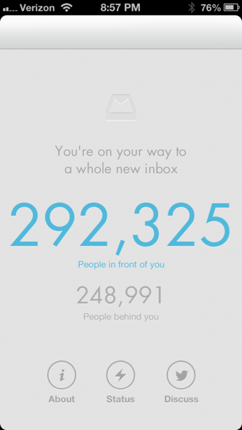

<h5>The line at Studio 54 – the king of night clubs</h5>

Years ago, I use to promote a number of night clubs in New York.  One trick I learned from the successful night club owners was to create a line outside even though there was no body inside.

The owners would keep looking outside and waited for the line to get long enough so that the door men could let people in at a slow pace and it would take an hour or two before the crowd made it through the door !  On top of that, people use to walk or drive by at 11 PM at night and say “What’s going on there?”.  This created even more excitement and more people want to get in.  To cut the line, people would try to bribe the doormen and other tricks.

In a nightclub, people like to be treated like cattle.  Think about it, do you want to go to a night club where there is no one inside or no one is waiting to go in?

Recently, I noticed the same trick being used by technology start ups.  [Mailbox](http://www.mailboxapp.com/ 'mailbox') which a new email app for gmail that displays your email with a post card metaphor (very similar to the [Flipboard](http://flipboard.com/ 'Flipboard'), the successful social reader) created lots of excitement for their app by making people wait and then telling them how many people were in front and behind them to get the app.  **I like this approach and I think it should be labeled the “Studio 54 effect”.**

  
Waiting to Get An Invite for Mailbox

Well, the trick seemed to work once again, today, it was [announced](http://techcrunch.com/2013/03/15/mailbox-cost-dropbox-around-100-million/ 'announced') that [Dropbox](https://www.dropbox.com/ 'Dropbox') bought [Mailbox](http://www.mailboxapp.com/ 'mailbox').  Rumor has it, Dropbox paid $100 million for Mailbox.  I wonder what other tricks we can use out of the old night club play book?  Ladies night or how about getting your name on the guest list?  I would love to hear your feedback…
