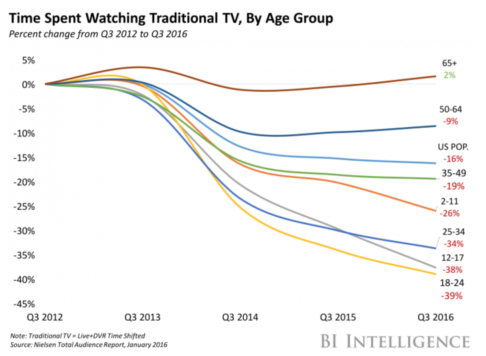

**What is HQ?**

HQ is a trivia game where you answer trivia questions to win a cash prize. The trivia questions cover a range of topics including sports, entertainment, pop culture, geography, health, vocabulary and more. If you get any of the questions wrong, you are out of the game. If you answer all the questions right, you and the other winners split the prize.

HQ is a mobile app that you download from the [Apple AppStore](https://itunes.apple.com/us/app/hq-live-trivia-game-show/id1232278996?mt=8) or [Google Play](https://play.google.com/store/apps/details?id=com.intermedia.hq&hl=en). After downloading the app, you create a user account and play the game at 3 PM ET weekdays and at 9 PM ET everyday.

Depending on the day, the prize can be either $2,500 or $15,000 dollars. As the game grows in popularity, HQ has been raising the cash prize.

The game starts with easy questions and around a million players. However, usually by the fourth question, HQ will throw in what they call a “Savage” question that knocks out a lot of people from the game. Usually by the last question, only a couple of hundred players are left. The winners split the cash prize.

**So what makes HQ different and how does this change broadcasting?**

Traditional game shows on broadcast television use the following format:

- A trivia game is played by several, pre-selected people and moderated by a game show host in a TV studio.
- Sometimes the game is played in front of a studio audience but this audience is not the ultimate consumer of the show.
- After the show is over, it is later broadcasted to a television audience, who is the intended audience.
- To the broadcast audience there is really nothing “live” about the game.

This format was first established back in the 1940’s starting with the first broadcast game show called [Truth or Consequences](https://en.wikipedia.org/wiki/Truth_or_Consequences).

The format worked well for many years on broadcast television because it was similar to it’s predecessor, radio. However, broadcasting which means to broadly cast a show to large audience is a one way medium (you can only watch or listen). Ratings for broadcast shows grew as televisions became affordable to millions of people.

However, this began to change in the late 1990’s with the introduction of high-speed internet in the home. From this point forward, the size of television audiences (including game shows) began to drop with maybe the exception of live television sports [(but even that’s starting to change)](https://www.statista.com/statistics/480119/cable-or-broadcast-tv-networks-extreme-or-action-sports-watched-within-the-last-12-months-usa/).

  
[Source: Business Insights - Analysis of Nielsen Total Audience Report](http://www.businessinsider.com/traditional-tvs-demographic-woes-get-worse-2017-1)

Today, people don’t see the same value of traditional television and have begun ["cord cutting"](https://en.wikipedia.org/wiki/Cord-cutting).

For broadcasting to be a profitable business, broadcasters need advertisers and advertisers generally sell their products and services to the 18+ adult segment. With the introduction of high-speed internet, the coveted 18+ adult segment spent less time watching broadcast television. Take a look where they spending more time now:

  
[Source: Nielsen Total Audience Report Q2 2017](http://www.nielsen.com/us/en/insights/reports/2017/the-nielsen-total-audience-q2-2017.html)

According to Nielsen Total Audience reports, 18+ adults are spending more time on the internet, smartphones and online games.

So what makes the Internet, smart phones and online games more compelling? For starters, this medium is a bi-directional technology and attracted billions of people. The billions of people are online all the time, everyone watches, everyone participates, people “Like" things, people love to comment and they share with each other. You just don’t get this with broadcast television.

Henceforth, the 18+ adult segment has now lost interest with broadcast television and If they do watch TV, they probably have their mobile devices in their hand and split their attention between the TV and their mobile device.

Now, let’s fast forward to 2018 and see how HQ is redefining the broadcast model.

With HQ, the broadcast game show has been completely turned upside down. The game is live, the game show host is live and the audience are now the players. Everyone feels the excitement when answering the question correctly and the agony of defeat when they get it wrong. The game makes it hard for the audience to divert their attention away or else they can lose the game.

Let’s stop and think about how different that this compared to even the internet model from the late 1990’s. HQ has created a model where a large audience simultaneously watches and interacts with a live video broadcast. Until a few years ago, live video broadcasts were hard to pull off. Slow mobile internet service and live video software was non-existiant or too expensive. On top of that, live video internet broadcasting was still a one way medium (you could only watch and not interact). With HQ, a new definition of broadcasting has been born.

So how does HQ grow this new medium and make it a profitable business? First they need to solve some challenges:

**Challenge 1: The Unfinished Business Model**

Today, it appears that HQ is not generating revenue. There is no fee for players to play the game and there are no commercials or sponsors paying for the production.

But like any business, HQ does incur costs. Here's a rough estimate of the costs:

Cost Type

Estimated Annual Cost (in US dollars)

Prize Money 

(as of Jan 2018)

$2,340,000

Labor

(including software engineers, researchers, design and production people and game show hosts to tell the jokes)

$1,650,000

3rd Party Software Licensing

(assuming HQ is using existing video software like AWS Elemental)

$300,000

Network Bandwidth

(assuming $.01 per phone per show, 1M phones per show, 624 shows per year)

$7,488,000

Sub total

$11,728,000

Misc Business Expenses

(15% of the sub total)

$1,177,000

Estimated Annual Cost

$12,955,000

A conservative estimate is that HQ will need about $13 million dollars per year to continue operating.

Some potential ways for HQ to generate revenue:

- Sponsorships or commercials - HQ could sell sponsorships that would be mentioned during the game. For example, “Today’s game brought to you by GEICO”.
- Product placement - sell advertisers the ability to place branded questions into the game. For example, “Which of the following is not a Budweiser product?"
- In-app purchases - Allow users to buy an extra life allowing them to get one question wrong during the game.
- Licensing - HQ could license their game software to other companies to use for their own game shows.
- A new undiscovered revenue method - like all good startups, HQ could identify a new revenue model as they build their platform. For example, Google figured out how to sell ads in their search results. This model which didn’t exist before search engines came along and is now a billions of dollars business.

**Challenge 2: Audience Burnout**

The HQ app was released in August 2017 and the number of daily active players has been growing ever since. This growth has been fueled by the uniqueness of the game, people inviting their friends to play and the steady increase in news and celebrity coverage. But eventually, this growth will slow or decline when people get tired of the game.

If everything stays the same, HQ could follow the same trajectory as the successful TV game show “Who Wants to be a Millionaire”. Broadcasted on the ABC television in August 1999, “Millionaire" had a specular growth curve and hit about 30 million viewers within weeks of it’s launch. Once ABC knew they had a hit on their hands, they increased the frequency of Millionaire to five nights a week. However, this overexposure and static game format caused the audience to quickly tire of the game and within two TV seasons it lost a majority of its viewers [Wikipedia](<https://en.wikipedia.org/wiki/Who_Wants_to_Be_a_Millionaire_(U.S._game_show)>).

**To prevent burnout, HQ needs to keep the audience interested. Some ways to change the current trivia game:**

- Add guest hosts - Recently, Jimmy Kimmel hosted the game which was a great idea. HQ should continue to bring on interesting hosts.
- Increase the prize money - As more people join the game, the number of winners increases and the payout per winner goes down (who’s excited to win a $1.66). Like Lotto games, people don't play when the prize money is low.
- Use different types of questions - Today’s questions are all multiple choice, text-based questions. HQ could ask the players to do other things like name this tune, pick the correct picture or use other types of questions to keep it interesting.
- Create a new game under the HQ brand. More on this idea in a minute...

**Challenge 3: The Company Name and the Trivia Game Name Are Too Tightly Connected**

Today, the name of the company is HQ Trivia and this name is strongly associated to the current trivia game. Think about it, there's no other name for the current game besides HQ. If HQ released another game, what would they call it? HQ 2.0? This naming convention makes it hard for HQ to introduce new and different games.

**Branding and Positioning Recommendations:**

HQ needs to quickly position the company separately from their games. I would keep using HQ as the company name and position it as a broadcast gaming platform. This approach has been successfully in traditional broadcasting. For example, if all Netflix shows were called Netflix, it would difficult for people to talk about the individual shows on that platform (for example, "Orange is the New Black”, “Stranger Things”, “House of Cards”). Now's the time for HQ to make this change.

**Challenge 4: Competition and Copy Cats**

Since the HQ audience is growing at a record pace, other companies are taking notice and will quickly adopt these broadcast strategies (ahem, cough, Facebook). Competitors with a larger user base can quickly catch up and surpass HQ.

To prevent this, HQ needs to relentlessly innovate on their broadcast model so they hit escape velocity, a term that legendary venture capitalists, Peter Thiel and Reid Hoffman have coined. Peter talks about escape velocity in detail in the [Masters of Scale](https://mastersofscale.com/) podcast hosted by Reid Hoffman. [Peter described how PayPal needed to hit escape velocity to stay ahead of Ebay and other competitors:](https://mastersofscale.com/peter-thiel-escape-the-competition/)

> "We needed to achieve escape velocity, we needed to grow so quickly that it would discourage anybody from even trying to compete with us. And so if you, if you could scale incredibly fast, on the one hand you have to race really hard to scale fast, but then the benefit if you do it is that you’re sort of achieving escape velocity from the black hole that is, that is hyper competition.” - _Peter Thiel, Masters of Scale Podcast_

The metric Peter was referring to in the podcast was the number of users signing up and using the product. This metric needed to see exponential growth and Thiel and Reid refer to it as the “X-Factor”. HQ has been hitting X-Factor growth, going from 0 users to 1.6 million users in six months. However, HQ needs to keep growing this number.

**A few growth strategies:**

- Continue to create brand awareness for HQ and position HQ as the premier broadcast game network. Continue to reenforce the brand visually throughout the game and by the game show hosts. For example, the hosts call the players “HQuties".
- As hinted to earlier, HQ needs to create more game and different game genres. These games could be played at different times of the day. For example, a music game would be interesting. A new take on "Name that Tune”.
- HQ could open up their platform and create a software development kit for other software developers to use. Amazon did this back in 2006 and called it Amazon Web Services (AWS). Today, a huge number of developers pay Amazon to use this AWS for their websites and mobile applications.

**Challenge 5: Which Path Will The HQ Founders Choose: Sell in Near Term or Go Big and Stay Independent?**

The HQ founders, Rus Yusupovwere and Colin Kroll were successful with their last venture, a mobile app called [Vine](https://vine.co/). Vine allowed people to record and share short videos. At the time, sharing videos on mobile was not easy and other mobile social mobile apps like Facebook, SnapChat and Instagram didn’t provide this capability so Vine became an instant hit.

However, Rus and Colin decided to sell Vine to Twitter in 2013 for a reported [$30 million dollars.](http://allthingsd.com/20121025/jack-dorsey-still-has-pull-at-twitter-just-ask-the-vine-guys/)

Once Vine was at Twitter, a decision was made to not integrate Vine into the existing Twitter app and keep it as a separate product. Eventually, Snapchat and Instagram copied the video sharing capability and integrated it into their existing apps. Since these apps had more users than Twitter, eventually people stopped using Vine. in 2016, due to lower marketshare and active users, [Twitter decided to shut down the Vine app.](https://medium.com/@vine/important-news-about-vine-909c5f4ae7a7)

Rus Yusupov, founder of Vine and who still worked at Twitter at the time tweeted: [“Don’t sell your company”.](https://twitter.com/rus/status/791681274339622913?lang=en)

> Don’t sell your company!
>
> — Rus (@rus) [October 27, 2016](https://twitter.com/rus/status/791681274339622913?ref_src=twsrc%5Etfw)

So what will Rus and Colin do this time around? Will they try to make HQ the next big social platform or will they sell again?

It probably depends on the next challenge…

**Challenge 6: Need More Funding**

To date, HQ has been funded by its co-founders. However, to keep things going and hit escape velocity, HQ will need a lot more funding to solve the challenges mentioned above. Recently, [Recode](https://www.recode.net/2017/12/6/16725140/hq-trivia-app-funding-valuation-investors) has reported that HQ has been seeking additional funding.

**\[Updated Feb 7th, 2018\]** - After this blog was published on Feb 2nd, 2018, [Peter Thiel decided to invest $15 million into HQ](https://thehustle.co/hq-raises-15-million-from-peter-thiel). Looks like challenge 6 has been solved.

**Time Will Tell**

So like all successful startups, HQ is doing well but still has an uphill climb. Hopefully, HQ will be able to pull it off and continue changing the broadcast model which is very well needed.
